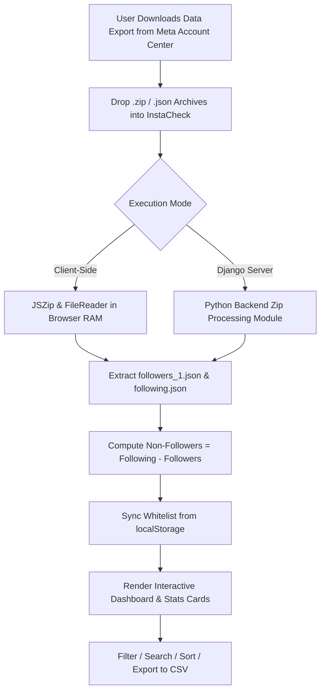

# 📸 InstaCheck - Privacy-First Instagram Non-Follower Tracker

[](https://www.python.org/)
[](https://www.djangoproject.com/)
[](https://developer.mozilla.org/en-US/docs/Web/JavaScript)
[](https://tailwindcss.com/)
[](#-privacy--security-guarantee)

> **InstaCheck** is a modern, privacy-focused web application designed to help users track who unfollowed them or who doesn't follow them back on Instagram — **without requesting Instagram passwords, API logins, or risking account bans.**

---

##  Key Features

-  **100% Privacy-First Architecture**: Parses official Instagram export `.zip` archives directly inside browser RAM (client-side via JSZip) or optional local Django backend. Zero server storage of your private data.
-  **No Passwords or Logins Required**: Avoid account suspensions or credential leaks caused by third-party unfollower apps.
-  **Instant Processing**: Analyze thousands of followers in seconds with real-time stats and metrics breakdown.
- **Rich Interactive Dashboard**:
  - **Metrics**: Total Followers, Total Following, Non-Followers Count, Mutual Followers.
  - **Search & Filter**: Search by username in real-time, filter by mutuals or non-followers.
  - **Whitelisting**: Pin users to your whitelist (persisted via `localStorage`).
  - **CSV Export**: One-click download of your non-followers list for offline record-keeping.
  - **Direct Profile Links**: Touch-friendly direct links to open Instagram profiles in 1 click.
-  **Live Demo Mode**: Includes synthetic demo data generation to test dashboard features instantly.
-  **Fully Responsive & AdSense Ready**: Glassmorphism dark mode UI built with Tailwind CSS, optimized for mobile devices and monetization.

---

##  Architecture & How It Works



---

##  Project Structure

```
instacheck/
├── manage.py                   # Django Management Script
├── db.sqlite3                  # Local SQLite Database (if needed)
├── implementation_plan.md      # Initial Project Specs & Architectural Plan
│
├── instacheck/                 # Frontend Web Application & Static Assets
│   ├── index.html              # Main Interactive Dashboard & Upload Interface
│   ├── results.html            # Results Render Template
│   ├── how-it-works.html       # Step-by-Step Data Export Download Guide
│   ├── privacy-architecture.html # Technical Breakdown of Local RAM Parsing
│   ├── faq.html                # Rate Limit Safety Rules & Accordion FAQ
│   ├── blog.html               # Educational SEO Articles & IG Health Guides
│   ├── contact.html            # Bug Report Form & Support
│   ├── tests.html              # Frontend Browser Unit Tests & Benchmarks
│   └── asset/
│       ├── css/
│       │   └── styles.css      # Dark Mode Glassmorphism Theme & Utilities
│       └── backend/
│           ├── Module.py       # Core Python Data Processing Class (`insta`)
│           └── __init__.py
│
├── instaapp/                   # Django Application Logic
│   ├── views.py                # Views for Upload Handling, Static Serving & Results
│   ├── urls.py                 # Route Mapping for App
│   ├── forms.py                # Form Handlers
│   └── tests.py                # Django Backend Unit Tests
│
└── instacheck_project/         # Django Project Configuration
    ├── settings.py             # Global Project Settings
    ├── urls.py                 # Root URL Router
    ├── wsgi.py                 # WSGI Gateway Interface
    └── asgi.py                 # ASGI Async Gateway Interface
```

---

##  Supported Instagram Export Formats

InstaCheck parses standard data exports requested via **Meta Account Center** (*Download Your Information*):

1. **JSON Format** *(Recommended)*:
   - Followers: `connections/followers_and_following/followers_1.json` (or `followers.json`)
   - Following: `connections/followers_and_following/following.json`
2. **ZIP Archives**:
   - Directly upload the entire raw `.zip` archive downloaded from Instagram.
3. **Individual File Uploads**:
   - Drag & drop individual `followers_1.json` and `following.json` files.

---

##  Quick Start Guide

### Option 1: Client-Side Standalone (No Python/Backend Required)

Simply serve the `instacheck/` directory using any static web server:

```bash
# Using Python built-in HTTP server
cd instacheck
python -m http.server 8000

# Or using Node npx serve
npx serve instacheck
```
Open `http://localhost:8000` in your web browser.

---

### Option 2: Full Django Web Application

1. **Clone the repository**:
   ```bash
   git clone https://github.com/Ashwanthkk/instacheck.git
   cd instacheck
   ```

2. **Set up a Python Virtual Environment**:
   ```bash
   python -m venv .venv
   # On Windows:
   .venv\Scripts\activate
   # On macOS/Linux:
   source .venv/bin/activate
   ```

3. **Install Dependencies**:
   ```bash
   pip install django
   ```

4. **Run Database Migrations & Start Development Server**:
   ```bash
   python manage.py migrate
   python manage.py runserver
   ```

5. **Access the App**:
   Navigate to `http://127.0.0.1:8000/` in your browser.

---

##  How to Download Your Instagram Data

1. Open Instagram on your phone or web browser.
2. Go to **Settings & Privacy** ➔ **Accounts Center**.
3. Select **Your information and permissions** ➔ **Download your information**.
4. Choose **Some of your information** and select **Followers and Following**.
5. Set format to **JSON** and Date Range to **All time**.
6. Submit the request. Once downloaded, drag & drop the `.zip` archive into **InstaCheck**.

---

##  REST API Endpoints (Django Backend)

InstaCheck backend provides an API endpoint for programmatic file analysis:

| Endpoint | Method | Description | Content-Type |
| :--- | :--- | :--- | :--- |
| `/` | `GET` | Renders the Main Dashboard | `text/html` |
| `/upload/` | `POST` | Upload ZIP archive containing followers/following JSON data | `multipart/form-data` |
| `/<filename>.html` | `GET` | Serves frontend SEO pages (`how-it-works`, `faq`, etc.) | `text/html` |

### Sample JSON API Request:
```bash
curl -X POST http://127.0.0.1:8000/upload/ \
  -H "Accept: application/json" \
  -F "zip_file=@/path/to/instagram-export.zip"
```

### Sample JSON API Response:
```json
{
  "total_followers": 450,
  "total_following": 520,
  "non_follower_count": 85,
  "non_followers": [
    "https://www.instagram.com/some_user_1",
    "https://www.instagram.com/some_user_2"
  ]
}
```

---

##  Running Unit Tests

### Django Backend Tests
```bash
python manage.py test instaapp
```

### Frontend JavaScript Unit Tests
Open `instacheck/tests.html` directly in your browser to run the suite of automated JS parsing, ZIP unpacking, and DOM rendering benchmarks.

---

##  Privacy & Security Guarantee

- **Zero Credentials**: InstaCheck never asks for your Instagram password, phone number, or 2FA codes.
- **Client-Side Safety**: All file parsing occurs inside your local browser memory via `JSZip` and `FileReader`.
- **Zero Data Harvesting**: No analytics scripts or database logs track your follower lists.

---


##  License

Distributed under the MIT License. See `LICENSE` for more information.
