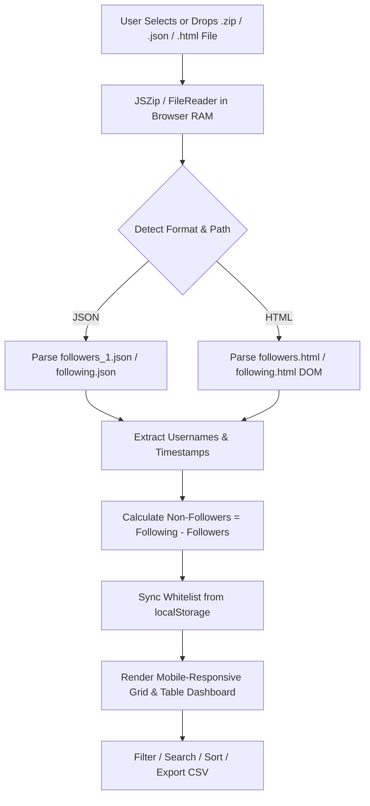

# Implementation Plan - InstaCheck: Privacy-Focused Instagram Non-Follower Tracker

Building a multi-page, privacy-focused, cross-platform web application for analyzing Instagram non-followers from official data export `.zip` files (JSON and HTML formats) completely client-side in browser RAM.

## User Review Required

> [!IMPORTANT]
> - **100% Client-Side Execution**: All processing is strictly performed inside browser memory using JSZip and FileReader. No passwords or API logins are requested.
> - **Multi-Page Architecture for Google AdSense**: Structured into 6 distinct HTML pages (`index.html`, `how-it-works.html`, `privacy-architecture.html`, `faq.html`, `blog.html`, `contact.html`) to maximize organic search authority and pass AdSense content quality guidelines.
> - **AdSense Banner Containers**: Styled, responsive container slots (`.adsense-banner`) positioned top, mid, and bottom across all pages for monetization readiness.

---

## Proposed Architecture & Component Design

### 1. Page Structure
- **`index.html` (Tool & Dashboard)**: 
  - Drag-and-drop file upload zone for Instagram `.zip` data export (or individual `.json`/`.html` files).
  - Built-in "Load Demo Data" button for immediate testing.
  - JSZip parsing engine for `connections/followers_and_following/` (both JSON & HTML formats supported).
  - Stats overview cards (Total Followers, Total Following, Non-Followers, Mutuals, Whitelisted).
  - Search filter bar, sorting, tab filters, CSV exporter, Whitelist manager (`localStorage`), and touch-friendly "Unfollow / Profile" direct links to Instagram.
- **`how-it-works.html` (Data Request Guide)**: 
  - Visual mobile-responsive tutorial on exporting Instagram data via Meta Account Center.
  - Interactive step cards with illustrations/screenshots placeholders and tips.
  - Direct call-to-action button back to analyzer tool.
- **`privacy-architecture.html` (Privacy & Security)**:
  - Deep-dive technical breakdown of local RAM parsing, zero server storage, no login requirement.
  - DevTools F12 audit guide for user network verification.
- **`faq.html` (FAQ & Safety Guidelines)**:
  - Accordion FAQ explaining Instagram rate limits (10–20 unfollows/hr), safety guidelines, troubleshooting zip parsing errors.
- **`blog.html` (Educational SEO Articles)**:
  - Long-form articles on Instagram health, account security, and data export formats for organic search traffic.
- **`contact.html` (Bug Report & Support)**:
  - Touch-friendly bug report form, anti-spam obfuscated email (`mailto:ashwanthkk43@gmail.com`), copy email button, and confirmation toasts.

---

## Technical Features & Parsing Logic



### Supported Instagram Export Formats:
1. **JSON Format**:
   - Followers: `connections/followers_and_following/followers_1.json` or `followers_and_following/followers.json`
   - Following: `connections/followers_and_following/following.json`
2. **HTML Format**:
   - Followers: `connections/followers_and_following/followers.html`
   - Following: `connections/followers_and_following/following.html`
3. **Single File Drops**:
   - Parsing individual `followers_1.json` and `following.json` dropped directly.

---

## Directory Structure

```
c:/insta/instacheck/
├── index.html                  # Main Tool & Results Dashboard
├── how-it-works.html           # Step-by-Step IG Data Request Guide
├── privacy-architecture.html   # Privacy & Zero-Server Security Tech Specs
├── faq.html                    # Accordion FAQ & Instagram Rate Limits
├── blog.html                   # SEO Educational Guides & Articles
├── contact.html                # Bug Report Form & Developer Support
└── assets/
    ├── css/
    │   └── styles.css          # Instagram Dark Theme, Glassmorphism & Responsive Utilities
    └── js/
        ├── app.js              # Core JSZip Parser Engine, State & Dashboard Controller
        ├── navbar.js           # Mobile Navigation Hamburger Toggle & Page Utilities
        └── demo-data.js        # Synthetic Sample Data Generator for Live Demo Mode
```

---

## Verification Plan

### Manual Verification
1. Open `index.html` in browser using a local HTTP dev server (`npx serve .` or `python -m http.server 8080`).
2. Test Demo Data button: Verify stats update, non-followers populate, search works, sorting works, CSV export works, and Whitelist toggle works.
3. Test Drag-and-Drop / Upload with realistic ZIP archives containing JSON and HTML formatted Instagram export data.
4. Test Mobile Responsiveness: Verify collapsible mobile nav menu, touch targets >= 48px, horizontal overflow scrolling protection for tables, and multi-column grid scaling on desktop.
5. Navigation Check: Click through all 6 pages (`how-it-works.html`, `privacy-architecture.html`, `faq.html`, `blog.html`, `contact.html`) to ensure header navbar, footer, and AdSense banner placeholders load seamlessly across all routes.
